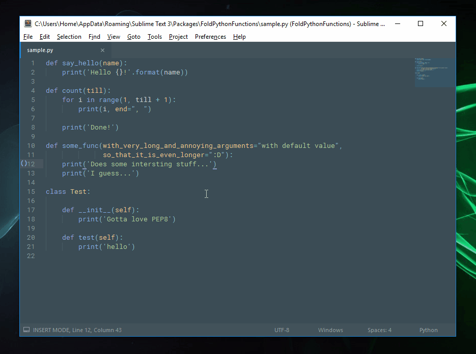

# FoldFunctions

This package contains a little single command that folds every functions in a python file.

The good part is that it supports PEP8 with arguments on the multiple lines, like so:

```python
def my_function(argument_number_one, argument_number_two,
                argument_number_three):
    print('It works!!')

    for i in range(10):
        print('It really does!')
```



## Installation

Because it is not available on package control for now, you have to add this repo "manually" to your list.

### Using package control

1. Open up the command palette (`ctrl+shift+p`), and find `Package Control: Add Repository`. Then enter the URL of this repo: `https://github.com/math2001/FoldFunctions` in the input field.
2. Open up the command palette again and find `Package Control: Install Package`, and just search for `FoldFunctions`. (just a normal install)

### Using the command line

```bash
cd "%APPDATA%\Sublime Text 3\Packages"             # on window
cd ~/Library/Application\ Support/Sublime\ Text\ 3 # on mac
cd ~/.config/sublime-text-3                        # on linux

git clone "https://github.com/math2001/FoldFunctions"
```

> Which solution do I choose?

It depends of your needs:

- If you intend to just use FoldFunctions, then pick the first solution (Package Control), **you'll get automatic update**.
- On the opposite side, if you want to tweak it, use the second solution. Note that, to get updates, you'll have to `git pull`

## Usage


The command is accessible from the command palette. 

- <kbd>ctrl+shift+p</kbd>
- Search for `Fold Python Functions`
- hit <kbd>enter</kbd>

*Make sure the current view has the python syntax on*


### Adding a key binding

It's up to you, but I prefer to have this command bound to this command, in my case, <kbd>alt+f</kbd>. So, here's what I've done:


```json
{
    "keys": ["alt+f"],
    "command": "fold_python_functions",
    "context": [
        {"key": "selector", "operand": "source.python"}
    ]
}
```

The `context` key makes this shortcut only available when you're coding in python (so that you can bind this same shortcut to a command that folds JavaScript functions for example)